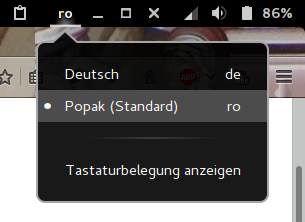

# popak-keyboard-layout-installer
A scripted installer for the romanian Popak keyboard layout http://www.invatasingur.ro/popak/index.php



WORK IN PROGRESS! DON'T RUN THIS YET!
-------------------------------------

I tested these manual steps for Debian 8 Jessie. The installer will do the same, automatically.

## Backup before modifications

Open a terminal as root and

```
# cd /usr/share/X11/xkb/rules
```

Backup the following files:

```
# cp evdev.xml evdev.xml.backup
# cp evdev.lst evdev.lst.backup

# cp base.xml  base.xml.backup
# cp base.xml  base.xml.backup
```

change directory to `symbols`:

```
# cd /usr/share/X11/xkb/symbols
```

and backup this file:

```
# cp ro ro.backup
```

## evdev.xml

Open the file `/usr/share/X11/xkb/rules/evdev.xml` for editing.

Search for `Romanian (WinKeys)`

You should find something like this:

```
<variant>
  <configItem>
    <name>winkeys</name>
    <description>Romanian (WinKeys)</description>
  </configItem>
</variant>
```

Add the two new variants _Popak (Standard)_ and _Popak (Cedilla)_ right beneath the _Romanian (Winkeys)_ fragment, between the closing tag `</variant>` and `</variantList>`. Make sure that `</variantList>` is under the new Popak variants. It should look like this:

```
  <variant>
    <configItem>
      <name>winkeys</name>
      <description>Romanian (WinKeys)</description>
    </configItem>
  </variant>

  <!-- begin popak -->
  <variant>
    <configItem>
      <name>popak_standard</name>
      <description>Popak (Standard)</description>
    </configItem>
  </variant>
  <variant>
    <configItem>
      <name>popak_cedilla</name>
      <description>Popak (Cedilla)</description>
    </configItem>
  </variant>
  <!-- end popak -->

</variantList> 
```

Save (and exit if you wish).


## base.xml

Open the file `/usr/share/X11/xkb/rules/base.xml` and repeat the modifications above.

Save and exit.


## evdev.lst

Open the file `/usr/share/X11/xkb/rules/evdev.lst` for editing.

Search for `Romanian (WinKeys)` again.

You should find something like this:

```
winkeys         ro: Romanian (WinKeys)
```

Add the two _Popak_ lines right beneath the _Romanian (Winkeys)_ line:

```
winkeys         ro: Romanian (WinKeys)
popak_standard  ro: Popak Standard
popak_cedilla   ro: Popak Cedilla
```

Save and exit.


## base.lst

Open the file `/usr/share/X11/xkb/rules/base.lst` and repeat the modifications above.

Save and exit.


## ro

Open the file `/usr/share/X11/xkb/symbols/ro` for editing.

Search for `xkb_symbols "cedilla"`

You should find something like this:

```
partial alphanumeric_keys
xkb_symbols "cedilla" {
    // Variant of the basic layout with cedillas.
    // Implements S and T with cedilllas as in ISO-8859-2.
    // Included for compatibility reasons (this used to be the def variant).

    include "ro(basic)"

    name[Group1]="Romanian (cedilla)";

    key <AD05> { [ t,                      T,  tcedilla,	 Tcedilla ] };
    key <AC02> { [ s,                      S,  scedilla,	 Scedilla ] };
};
```

Add this block right beneath the one you found:

```
partial default alphanumeric_keys
xkb_symbols "popak_standard" {
// Popak layout, developed by Nicolae Popa (nicolae.m.popa@gmail.com)
// http://www.invatasingur.ro/popak
// Standard variation (with correct diacritics)

    include "us"

    name[Group1]="Romania";

    key <AE01> { [ 1,                 exclam,  section			  ] };
    key <AE02> { [ 2,                     at,  copyright		  ] };
    key <AE03> { [ 3,             numbersign,  guillemotleft 	  	  ] };
    key <AE04> { [ 4,                 dollar,  guillemotright		  ] };
    key <AE05> { [ 5,                percent,  degree			  ] };
    key <AE11> { [ endash,	     	   question			  ] };
    key <AD01> { [ b,                      B,  plusminus		  ] };
    key <AD02> { [ p,                      P,  underscore 	          ] };
    key <AD03> { [ c,                      C,  braceleft  	          ] };
    key <AD04> { [ m,                      M,  braceright		  ] };
    key <AD05> { [ v,                      V,  bar			  ] };
    key <AD06> { [ acircumflex,            Acircumflex			  ] };
    key <AD07> { [ icircumflex,            Icircumflex			  ] };
    key <AD08> { [ abreve,                 Abreve			  ] };
    key <AD09> { [ d,                      D	 			  ] };
    key <AD10> { [ f,                      F	 			  ] };
    key <AD11> { [ w,                      W	 			  ] };
    key <AD12> { [ k,                      K	 			  ] };
    key <AC01> { [ l,                      L,  doublelowquotemark         ] };
    key <AC02> { [ t,                      T,  rightdoublequotemark	  ] };
    key <AC03> { [ r,                      R,  less 			  ] };
    key <AC04> { [ n,                      N,  greater 			  ] };
    key <AC05> { [ s,                      S,  EuroSign 		  ] };
    key <AC06> { [ o,                      O	 			  ] };
    key <AC07> { [ a,                      A	 			  ] };
    key <AC08> { [ e,                      E	 			  ] };
    key <AC09> { [ i,                      I	 			  ] };
    key <AC10> { [ u,                      U	 			  ] };
    key <AC11> { [ z,                      Z	 			  ] };
    key <LSGT> { [ q,            	   Q                              ] };
    key <BKSL> { [ q,            	   Q                              ] };
    key <AB01> { [ y,                      Y,  apostrophe 	       	  ] };
    key <AB02> { [ 0x1000219,      0x1000218,  quotedbl 	       	  ] };
    key <AB03> { [ 0x100021b,      0x100021a,  bracketleft 	       	  ] };
    key <AB04> { [ h,                      H,  bracketright 	       	  ] };
    key <AB05> { [ x,                      X,  backslash 	       	  ] };
    key <AB06> { [ j,                      J		 	       	  ] };
    key <AB07> { [ g,                      G		 	       	  ] };
    key <AB08> { [ comma, 	   semicolon		          	  ] };
    key <AB09> { [ period,             colon 	      		    	  ] };
    key <AB10> { [ minus,              slash 	      		    	  ] };

    include "level3(ralt_switch)"
};

partial alphanumeric_keys
xkb_symbols "popak_cedilla" {
    // Variant of the Popak layout with cedillas.
    // Implements S and T with cedilllas as in ISO-8859-2.
    // Included for compatibility reasons.

    include "ro(popak_standard)"

    name[Group1]="Romania";

    key <AB02> { [ scedilla,      Scedilla,  quotedbl 	       	  	  ] };
    key <AB03> { [ tcedilla,      Tcedilla,  bracketleft 	       	  ] };
};
```

Save and exit.


Reboot
----
